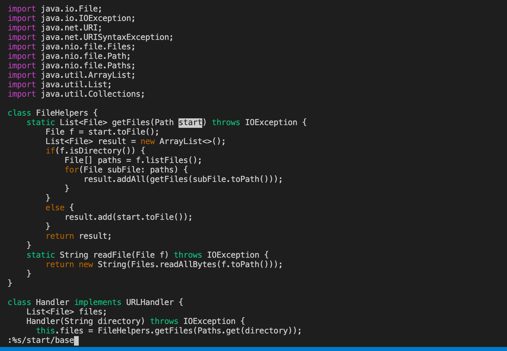
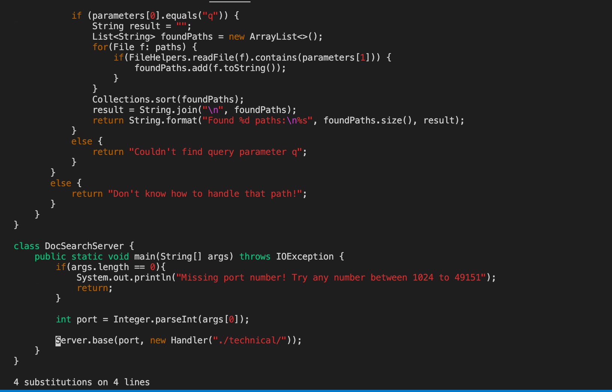
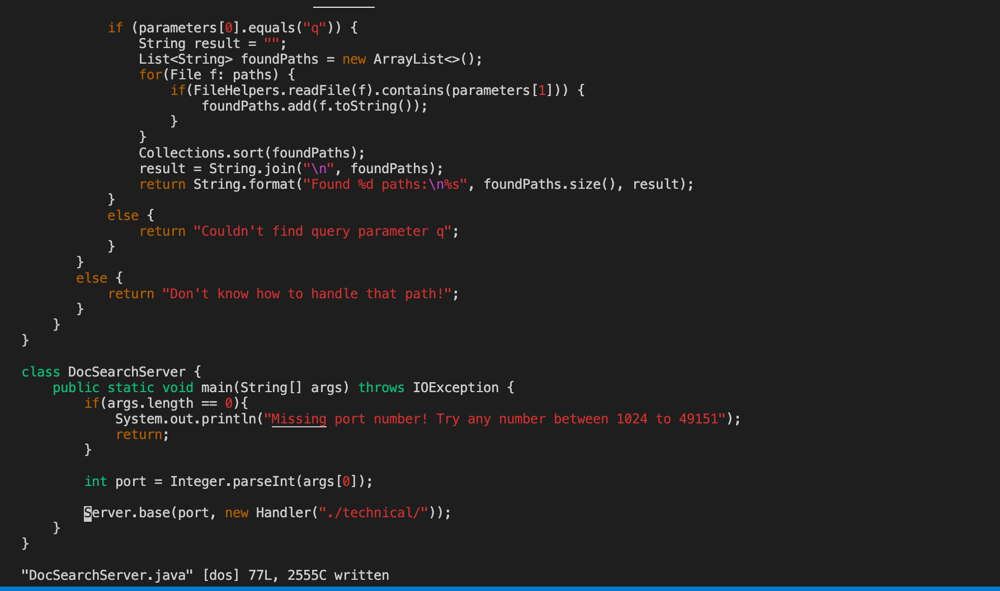

# Part I
- Changing the name of the start parameter and its uses to base

`:%s/start/base/g<Enter>:w<Enter>`

screenshot of `:%s/start/base`

screenshot of `/g<Enter>`

screenshot of `:w<Enter>`

# Part II
way 1: 10 min
way 2: 3 min

Which of these two styles would you prefer using if you had to work on a program that you were running remotely, and why?

I prefer using IDE. It has ability to detect syntax error.

What about the project or task might factor into your decision one way or another? (If nothing would affect your decision, say so and why!)
1. If it's a small change and not complicated, I'd rather ssh into remote and do vim change, since it saves a lot of time by `scp` and figure out paths.
2. If I am working on a large project development, I will use VS Code IDE so that I can easily jump from definitions and function calls, and it speeds up my coding by providing a lot of useful features(auto complete and etc.).

